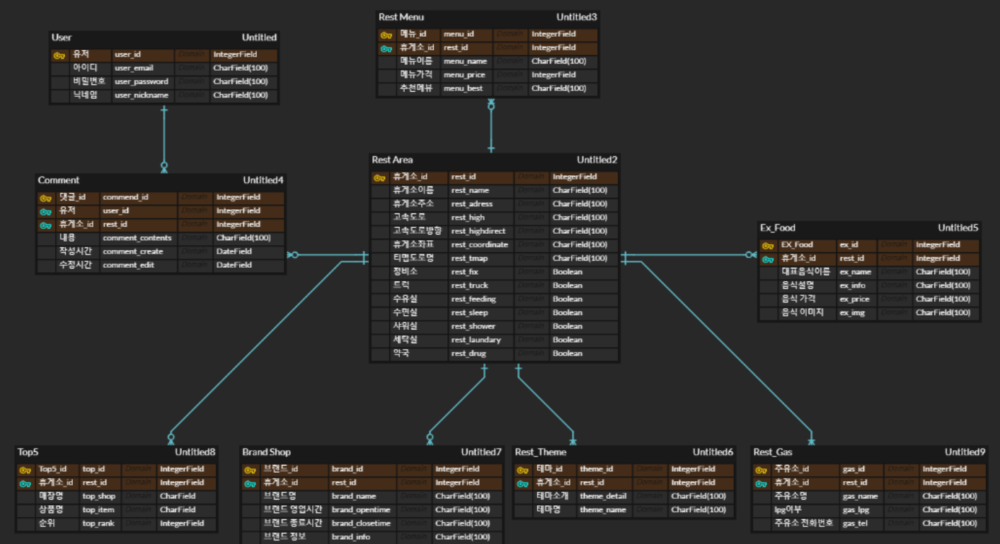

# Hu:Get

### 전국 고속도로 휴게소의 정보를 제공해주는 서비스

## 프로젝트 소개

### 기획배경

---

구미에서 부산의 고향으로 가는 중, 출출해서 별 생각없이 가까운 휴게소에 들러 핫바를 사먹고 내려갔다. 이러한 이야기를 팀원과 하는 도중, 다음 휴게소에서 매년 한국도로공사가 선정하는 24개의 메뉴인 EX-FOOD에 선정된 음식이 있다는 것을 알게 되었고, 우리는 조금만 더 참고 갔으면, 이걸 미리 알았더라면 하는 후회를 하게 되었다.

휴게소에 대한 정보를 미리 알 수 있다면, 여행이나 출장 시 좀 더 풍성하고 즐거운 영향을 끼칠 수 있을거라 생각하여, 한국도로공사 공공 API를 활용한 정보를 제공하는 서비스를 기획하게 되었다.

## FRONTEND

[공통]

- 간단한 소개와 휴게소 정보 관련 4가지 카테고리 표시
- 뒤로가기 버튼 : 히스토리를 활용한 뒤로가기 버튼

[화면 우측 하단 플로팅 버튼 기능]

- 메인페이지 이동

- 공통 : 홈으로, BackTop 버튼

- 비로그인시 : 로그인 표시

- 로그인시 : 회원정보수정, 로그아웃 표시

- 사용자 정보 수정

- 스크롤바 화면 최상단으로 이동

  

[계정관리 페이지]

- /Login
  - 로그인 페이지
  - 로그인 시 휴게소 상세보기 페이지에서 댓글 작성 가능

- /SignUp
  - 회원가입 페이지
  - Id, Password, Nickname, Email 입력
  - 입력값에 대한 유효성 검사 포함
- /EditUser
  - 회원정보 수정 페이지
  - Id를 제외한 모든 항목 변경 가능

[휴게소 찾기 페이지]

- 공통

  - 지도상에 휴게소 위치 마커 표시
  - 마커 클릭 시 휴게소 상세정보 화면으로 이동할 수 있는 하단 팝업 출력
  - 우측 상단에 사용자의 현재 위치를 표시하는 버튼 포함

- /Search

  - 휴게소 이름을 부분/전체적으로 입력 시 이름에 검색어를 포함하는 모든 휴게소 목록 자동완성

- /Highway

  - 선택한 고속도로에 위치한 모든 휴게소를 보여줌
  - 조회할 고속도로와 방향(상행/하행) 선택

- /Root

  - 출발지와 도착지 주소 입력(지번 주소, 도로명 주소 모두 지원)
  - 경로 탐색 버튼 클릭 시 현재 교통 정보를 반영한 최적의 경로를 지도에 표시하며, 해당 경로에 위치한 모든 휴게소를 보여줌
  - 한계 : 좌표를 기반으로 방향을 정하는 알고리즘이 모호하여 양방향 휴게소가 모두 표시

  

[휴게소 상세정보 페이지]

- /Detail/{휴게소이름}

  - 네브바 : 기본정보, 여기서만, 후기 3가지 카테고리

    라우터 대신 스크롤뷰를 사용해 클릭시 해당 섹션 위치로 이동

    a태그를 사용할 경우 히스토리에 남게 되어 button태그를 사용함

  - 기본정보 : 휴게소 주소 및 전화번호, 편의시설, 매출정보

    - 편의시설 : 시각적 편의를 위해 아이콘 활용, 313px 이하일 경우 글자만 표시
    - 매출정보 : 매출 Top 5를 나타내기 위해 차트 형태의 css 디자인

  - 여기서만 : 해당 휴게소만의 내용

    - ex-food : 매년 한국도로공사에서 지정하는 20개의 메뉴, 있으면 카드형식으로 표시됨

    - 베스트메뉴 : 해당 휴게소에서 추천하는 메뉴 표시(이름, 가격)

    - 식당 및 매장 정보 :

      모달을 활용하여 휴게소 식당 전체 메뉴 표시(메뉴판 디자인)

      테이블 형식으로 입점된 매장 정보 표현(브랜드명, 운영시간, 간단정보), 313px 이하일 경우 카드로 반응

    - 테마관 : 해당 휴게소에서 제공하는 특별한 테마 설명

  - 후기 : 댓글기능

    글 작성한 사람만 수정, 삭제 가능

[먹거리 검색 페이지]

- /SearchMenu
  - 메뉴명만 입력 - 이름에 해당 검색어가 포함된 메뉴를 전체 휴게소에서 검색
  - 메뉴명, 고속도로 정보 입력 - 선택한 고속도로에 위치한 휴게소에 한해서 검색
  - 메뉴명, 고속도로 정보, 방향 정보 입력 - 선택한 고속도로의 진행 방향에 위치한 휴게소에 한해서 검색

## BACKEND

Django Rest Framework와 Sqlite3를 통해 구축

별도의 회원 가입이 없이 서비스 이용 가능하게 함

회원가입시 댓글을 달 수 있음

serializer를 통해 json 파일로 데이터들을 관리 송, 수신

---

### ERD

---

### API

[User]

- User register
  - URL : https://k3d202.p.ssafy.io/api/auth/register/ [POST]
  - username, password, nickname, email을 받아 가입
- User Login
  - URL : https://k3d202.p.ssafy.io/api/auth/login/ [POST]
  - username, password 전달
  - Token 생성됨
- User Profile
  - URL : https://k3d202.p.ssafy.io/auth/user/profile/ [UPDATE]
  - 회원가입 정보 입력 시 양식에 맞으면 회원 정보가 바뀌게 됨

[REST]

- REST
  - URL : https://k3d202.p.ssafy.io/api/auth/rest/ [GET]
  - 각 휴게소의 도로, 방향, 위치, 편의시설 등의 정보를 가져옴
  - 좌표와 고속도로정보를 비교하여 지도상에 띄울 수 있음

- RESTInfo
  - URL : https://k3d202.p.ssafy.io/api/auth/rest/info/ [POST]
  - 휴게소의 이름을 통해서 해당 휴게소의 음식, EX음식 여부, 매출 상위 5개품목, 휴게소유무, 테마휴게소 여부 등을 제공함

- BRANDInfo
  - URL : https://k3d202.p.ssafy.io/api/auth/rest/brand/ [POST]
  - 휴게소의 이름을 통해 해당 휴게소에 있는 브랜드 매장 정보를 보낸다

[Comment]

- Rest comment

  - URL : https://k3d202.p.ssafy.io/api/auth/rest/(str:restname)comment/  [GET]
  - Login 후 생성된 Token 전달
  - 해당 휴게소에 작성된 모든 user들의 Comment 확인

- Comment create/edit

  - URL : https://k3d202.p.ssafy.io/api/comment/
  - Comment Create  [POST]
    - Login 후 생성된 Token과 함께 rest_name, comment_content 전달
  - Comment Edit  [PUT]
    - Login 후 생성된 Token과 함께 rest_name, comment_pk, comment_content 전달

- Comment delete

  - URL : https://k3d202.p.ssafy.io/api/auth/rest/(str:restname)comment/(int:comment_pk)/ [DELETE] 

    - Login 후 생성된 Token과 함께 recipe_pk, comment_pk 전달

[SEARCH]

- SearchFood
  - URL : https://k3d202.p.ssafy.io/api/search/food/ [POST]
  - 궁금한 음식을 검색하면 해당 음식을 판매하는 휴게소 정보를 제공함
  - 검색한 단어가 포함된 모든 음식들에 대해서 나옴
- SearchFoodHighway
  - URL : https://k3d202.p.ssafy.io/api/search/foodhigh/ [POST]
  - 음식과 함께 현재 고속도로 정보를 입력하면 해당 고속도로의 휴게소 중 음식을 파는 휴게소가 나옴
  - 해당 휴게소에서 판매하는 음식 정보등을 알 수 있음

---

### 배포

Ubuntu 18.04.1 버전에서 Nginx와 Let's Encrypt를 활용해 SSL적용을 하여 https 배포를 함

---

### 개발스택

#### 협업

- Jira
- GitLab
- Mattermost

#### DB

- Django
- SQLight3

#### Framework

- React
- Django RestFramework
- Node Js

---

SSAFY 3기 구미 2반 D202 - Merry Christmas

- Frontend
  - 이동규
  - 배병준
  - 박강민
- Backend
  - 한광욱

| 담당자 | 담당업무                                                     | 사용언어/툴                              |
| :----- | :----------------------------------------------------------- | ---------------------------------------- |
| 이동규 | 팀장,  Front-end 데이터 수집 및 ERD 구축 UX/UI 디자인, CSS | React.js, reactstrap, antd HTML/CSS |
| 배병준 | Front-end csv파일을 활용한 지도 맵핑 경로탐색 알고리즘 | React.js, reactstrap, antd HTML/CSS |
| 박강민 | Front-end 수집 데이터 정제 보조 UX/UI 디자인, CSS  | React.js, reactstrap, antd HTML/CSS |
| 한광욱 | Back-end ERD 구축 및 데이터 가공 API 구축 경로탐색 알고리즘 | Django, SQLite                           |

